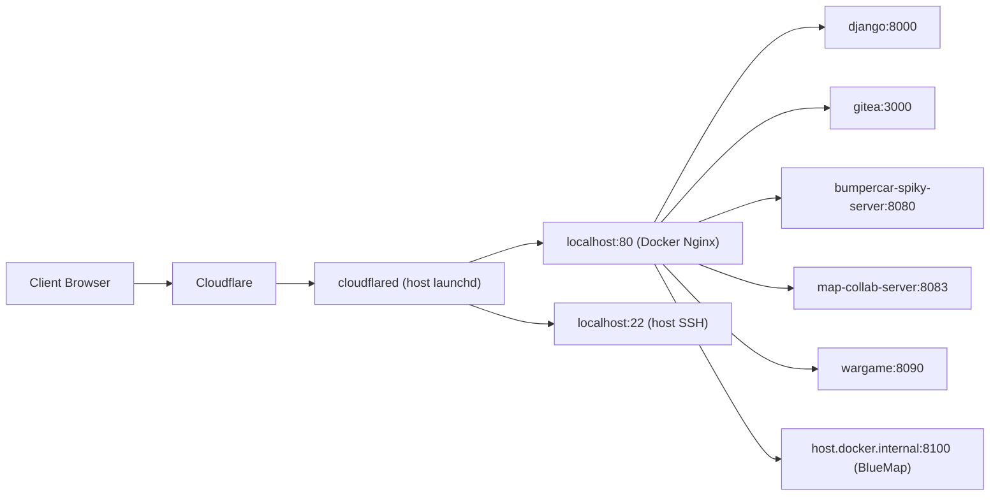
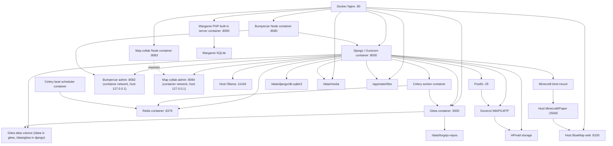

# Hanplanet

Hanplanet은 하나의 Django 프로젝트 안에 아래 기능을 함께 운영하는 통합 서비스입니다.

- 루트 탐색/검색 홈
- 포트폴리오/프로젝트 상세
- HanDrive 문서·파일 작업 공간
- HanDrive 동기화 API와 Go 기반 `sync-client`
- HanDrive와 연결된 Git 저장소 관리
- GitHub/Google 계정 연동, Google Drive 가상 폴더
- Forgejo(Gitea) 기반 Git 웹 UI
- HanHarness CLI 다운로드/권한/토큰 쿼터 관리
- HPmail 웹메일, 계정/별칭/앱 비밀번호 관리
- HanDrive 지도 뷰어/에디터와 실시간 맵 협업 서버
- 실시간 멀티플레이어 게임 `Bumper Car Spiky`
- 독립 Apache/PHP/SQLite 기반 Wargame 서비스
- 기타 `Stratagem Hero`, `Salvation's Edge 4`
- Minecraft 서버 상태/콘솔/BlueMap 프록시
- Ollama 기반 AI 챗봇
- Ollama를 OpenAI-compatible API로 노출하는 `/ai/v1` 프록시
- 접속 로그 수집/요약과 운영용 관리 화면

운영 기준 주소:

- 메인 서비스: [https://www.hanplanet.com](https://www.hanplanet.com)
- 루트 도메인: [https://hanplanet.com](https://hanplanet.com)
- Git 웹 UI: [https://git.hanplanet.com](https://git.hanplanet.com)
- HPmail 웹메일: [https://www.hanplanet.com/ko/Email/](https://www.hanplanet.com/ko/Email/)
- Minecraft 상태/지도: [https://mc.hanplanet.com](https://mc.hanplanet.com)
- 게임 WebSocket: `wss://game.hanplanet.com`
- 맵 협업 WebSocket: `wss://map-collab.hanplanet.com`
- Wargame: [https://wargame.hanplanet.com](https://wargame.hanplanet.com)
- OpenAI-compatible AI 프록시: `https://hanplanet.com/ai/v1`

추가 운영 규칙과 에이전트용 상세 작업 규칙은 [PROJECT_GUIDELINES.md](./PROJECT_GUIDELINES.md)를 참고하세요.

## 서비스 전체 구조

### 1. 공개 트래픽 경로

현재 운영 ingress는 호스트 launchd로 실행되는 Cloudflare Tunnel이 먼저 받고, 모든 HTTP 도메인을 호스트 `localhost:80`으로 전달합니다. `localhost:80`은 Docker Compose의 `nginx` 컨테이너가 publish한 포트이며, Nginx가 각 컨테이너와 남아 있는 호스트 서비스로 라우팅합니다.



현재 `~/.cloudflared/config.yml` 기준:

- `www.hanplanet.com`, `hanplanet.com`, `mc.hanplanet.com`, `git.hanplanet.com`, `game.hanplanet.com`, `map-collab.hanplanet.com`, `wargame.hanplanet.com` -> `http://localhost:80`
- `ssh.hanplanet.com` -> `ssh://localhost:22`

컨테이너형 Cloudflare Tunnel을 쓸 때는 [`docker/cloudflared/config.yml.example`](./docker/cloudflared/config.yml.example)처럼 HTTP hostname을 모두 `http://nginx:80`으로 보냅니다. HPmail(Postfix/Dovecot), Minecraft/Paper/BlueMap, Ollama는 아직 컨테이너 밖 호스트 서비스로 남기고 Docker 내부에서는 `host.docker.internal`로 연결합니다.

### 2. 호스트 내부 서비스 구조



### 3. 서버별 역할

| 서버/서비스 | 역할 | 주요 설정 파일 |
| --- | --- | --- |
| Django + Gunicorn | 메인 웹, API, 템플릿 렌더링, HanDrive, 포트폴리오, 게임/맵/동기화 토큰 발급. Docker에서는 `django` 서비스 | [`Dockerfile`](./Dockerfile), [`docker/entrypoint.sh`](./docker/entrypoint.sh), [`config/settings.py`](./config/settings.py), [`main/views.py`](./main/views.py), [`main/handrive_views.py`](./main/handrive_views.py), [`main/sync_views.py`](./main/sync_views.py) |
| Django 분리 앱 | AI 프록시/사용량, GitHub/Google/Gitea 모델, HPmail, portfolio/stratagem 모델 | [`ai/`](./ai/), [`git/`](./git/), [`hpmail/`](./hpmail/), [`portfolio/`](./portfolio/), [`stratagem/`](./stratagem/) |
| Gitea | Git 저장소 웹 UI, bare repo 저장소, OAuth/세션 기반 Git 웹. Docker에서는 `gitea` 서비스와 커스텀 이미지 사용 | [`docker/gitea/Dockerfile`](./docker/gitea/Dockerfile), [`docker/gitea/entrypoint.sh`](./docker/gitea/entrypoint.sh), [`forgejo/custom/conf/app.ini`](./forgejo/custom/conf/app.ini), [`forgejo/custom/templates/`](./forgejo/custom/templates/) |
| Celery worker | HanDrive -> Git 저장소 생성/재시도 같은 비동기 작업. Docker에서는 `celery` 서비스 | [`main/git_tasks.py`](./main/git_tasks.py), [`docker-compose.yml`](./docker-compose.yml) |
| Celery beat | 만료 세션과 HanDrive 튜토리얼 임시 드라이브를 주기 정리하는 스케줄러. Docker에서는 `celery-beat` 서비스 | [`main/tasks.py`](./main/tasks.py), [`config/settings.py`](./config/settings.py), [`docker-compose.yml`](./docker-compose.yml) |
| Redis | Celery broker. Docker에서는 `redis:7-alpine` 서비스 | [`docker-compose.yml`](./docker-compose.yml) |
| HPmail | 웹메일 UI/API, Postfix map export, Dovecot IMAP 읽기, SMTP 발송. Postfix/Dovecot은 아직 호스트 서비스 | [`hpmail/`](./hpmail/), [`deploy/hpmail/`](./deploy/hpmail/), [`deploy/launchd/com.hanplanet.dovecot.plist`](./deploy/launchd/com.hanplanet.dovecot.plist) |
| Node game server | 실시간 범퍼카/스피키 월드 시뮬레이션, JWT 검증, WebSocket, Docker 내부 admin API | [`bumpercar-spiky-server/Dockerfile`](./bumpercar-spiky-server/Dockerfile), [`bumpercar-spiky-server/server.js`](./bumpercar-spiky-server/server.js), [`bumpercar-spiky-server/world/world.js`](./bumpercar-spiky-server/world/world.js) |
| Map collab server | HanDrive 지도 뷰어 실시간 협업, presence/admin endpoint | [`map-collab-server/Dockerfile`](./map-collab-server/Dockerfile), [`map-collab-server/server.js`](./map-collab-server/server.js), [`map-collab-server/network/websocket.js`](./map-collab-server/network/websocket.js) |
| Wargame PHP | `wargame.hanplanet.com` 전용 PHP 앱, 문제/플래그/SQLite 격리. Docker에서는 PHP built-in server `:8090` | [`Wargame/Dockerfile`](./Wargame/Dockerfile), [`Wargame/docker-entrypoint.sh`](./Wargame/docker-entrypoint.sh), [`Wargame/README.md`](./Wargame/README.md) |
| Ollama | `/api/chat/`, `/ai/v1/*`의 LLM 백엔드 | [`config/settings.py`](./config/settings.py), [`ai/views.py`](./ai/views.py) |
| Minecraft/Paper | `mc.hanplanet.com` 상태 페이지, 콘솔 API, BlueMap 프록시 | [`scripts/run_minecraft_server.sh`](./scripts/run_minecraft_server.sh), [`scripts/write_minecraft_status.py`](./scripts/write_minecraft_status.py), [`minecraft-status-plugin/`](./minecraft-status-plugin/) |
| Nginx | Docker ingress reverse proxy, static/media alias, access log JSON, `/ai/` long-streaming proxy, Git/Game/Map/Wargame/Minecraft/BlueMap 라우팅 | [`docker/nginx/default.conf`](./docker/nginx/default.conf), [`docker-compose.yml`](./docker-compose.yml) |
| Cloudflare Tunnel | 공개 도메인 -> Docker Nginx 라우팅. 호스트 launchd 또는 컨테이너 profile 둘 다 가능 | `~/.cloudflared/config.yml`, [`docker/cloudflared/config.yml.example`](./docker/cloudflared/config.yml.example) |

## 서버들은 어떻게 연동되는가

### HanDrive + Git 연동

1. 사용자가 HanDrive에서 폴더를 Git 저장소로 생성 요청
2. Django API가 `GitRepository` 레코드를 만들고 Celery 작업을 큐에 넣음
3. Celery가 Forgejo API를 호출해 저장소를 만들고 파일을 push
4. HanDrive는 이 저장소를 가상 폴더/브랜치 구조처럼 렌더링
5. 브랜치 내부 수정/업로드/이동/삭제는 temp clone -> commit -> push 경로로 처리

관련 코드:

- 요청/상태 API: [`main/views.py`](./main/views.py)
- Forgejo API client: [`main/forgejo_client.py`](./main/forgejo_client.py)
- 서비스 계층: [`main/git_service.py`](./main/git_service.py)
- Celery task: [`main/git_tasks.py`](./main/git_tasks.py)
- HanDrive 가상 Git 경로 처리: [`main/handrive_views.py`](./main/handrive_views.py)

### HanDrive + 외부 계정/스토리지 연동

1. GitHub/Google OAuth는 Django 세션에 pending state를 저장한 뒤 provider callback에서 계정 매핑을 생성
2. GitHub 저장소와 Google Drive 선택 항목은 HanDrive 안에서 가상 폴더처럼 노출
3. Google Drive 파일은 Drive API로 metadata/download/upload/move/delete를 처리
4. GitHub 저장소는 cache root에 clone/fetch한 뒤 HanDrive 파일 작업과 이어짐
5. MinIO/S3 호환 스토리지는 sync client 업로드/다운로드 URL 발급 경로에서 사용

관련 코드:

- OAuth helper: [`main/github_auth.py`](./main/github_auth.py), [`main/google_auth.py`](./main/google_auth.py)
- Google Drive client: [`main/google_drive.py`](./main/google_drive.py)
- MinIO helper: [`main/minio_client.py`](./main/minio_client.py)
- 계정 매핑 모델: [`git/models.py`](./git/models.py)

### HanDrive Sync Client 연동

1. `sync-client/`의 Go 클라이언트가 `/api/sync/auth/token`으로 access/refresh token을 발급받음
2. 클라이언트가 `/api/sync/files`, `/api/sync/changes`로 서버 파일 목록과 변경분을 polling
3. 업로드는 init-upload -> upload data -> complete 순서로 처리
4. 다운로드는 presigned URL 또는 proxy endpoint를 사용
5. 서버 저장소 모드(`DISC`) 변경은 `/api/sync/storage-mode`로 감지하고 클라이언트가 full sync를 다시 수행

관련 코드:

- Django API: [`main/sync_views.py`](./main/sync_views.py), [`main/sync_auth.py`](./main/sync_auth.py)
- Go 클라이언트: [`sync-client/`](./sync-client/), [`sync-client/README.md`](./sync-client/README.md)

### 게임 서버 연동

1. 브라우저가 범퍼카 페이지를 Django에서 렌더링
2. 클라이언트가 `/api/game-auth-token/`으로 JWT 요청
3. Django가 게임 전용 JWT 발급
4. 브라우저가 `wss://game.hanplanet.com`으로 WebSocket 연결
5. Docker Nginx가 WebSocket upgrade를 `bumpercar-spiky-server:8080`으로 전달
6. Node 게임 서버가 JWT를 검증하고 월드 시뮬레이션에 플레이어를 추가
7. 게임 결과 통계는 Node -> Django 내부 API `/api/internal/bumpercar-spiky/stats/`로 저장되며, Docker에서는 `BUMPERCAR_SPIKY_INTERNAL_SECRET` 헤더로 인증
8. Django 관리자 화면의 NPC 체력/런타임 재시작은 `GAME_ADMIN_URL`의 admin API를 호출함
9. 월드 상태를 msgpack/WebSocket으로 브라우저에 지속 전송

관련 코드:

- 게임 페이지/토큰 API: [`main/views.py`](./main/views.py)
- WS 서버: [`bumpercar-spiky-server/network/websocket.js`](./bumpercar-spiky-server/network/websocket.js)
- 게임 루프: [`bumpercar-spiky-server/game/gameLoop.js`](./bumpercar-spiky-server/game/gameLoop.js)
- 월드 판정: [`bumpercar-spiky-server/world/world.js`](./bumpercar-spiky-server/world/world.js)

### HanDrive 맵 협업 연동

1. 사용자가 HanDrive map viewer/editor를 열면 Django가 맵 경로와 사용자 권한을 확인
2. 브라우저가 `/api/map-collab-auth-token/`으로 협업 JWT와 WebSocket URL을 요청
3. 브라우저가 `wss://map-collab.hanplanet.com`으로 연결
4. Docker Nginx가 WebSocket upgrade를 `map-collab-server:8083`으로 전달
5. Node 맵 협업 서버가 JWT를 검증하고 방 단위로 stroke/text/ping/presence 이벤트를 중계
6. Django admin의 맵 협업 세션 화면은 Docker에서는 `http://map-collab-server:8084`, 네이티브 launchd에서는 `http://127.0.0.1:8084` admin endpoint로 현재 방/사용자 상태를 조회

관련 코드:

- 토큰/프레즌스 API: [`main/views.py`](./main/views.py)
- 맵 뷰어 UI: [`templates/handrive/map_viewer.html`](./templates/handrive/map_viewer.html)
- WS 서버: [`map-collab-server/network/websocket.js`](./map-collab-server/network/websocket.js)
- admin endpoint: [`map-collab-server/network/admin.js`](./map-collab-server/network/admin.js)

### Wargame 연동

1. `wargame.hanplanet.com`은 Cloudflare Tunnel -> Docker Nginx -> `wargame:8090`으로 전달
2. Docker 운영에서는 `Wargame/Dockerfile` 이미지가 PHP built-in server를 `0.0.0.0:8090`에서 실행하고 `Wargame/public/`만 document root로 노출
3. 네이티브 launchd 운영에서는 별도 Apache 설정 [`Wargame/deploy/apache/httpd-wargame.conf`](./Wargame/deploy/apache/httpd-wargame.conf)을 사용
4. 문제/플래그/힌트/문제별 상태는 `Wargame/data/wargame.sqlite3` 또는 Docker volume `/app/Wargame/data/wargame.sqlite3`만 사용
5. 사이트 통합이 필요한 로그인 상태, navbar, 풀이 기록, 사용자 설정만 Django API와 통신
6. Wargame PHP는 Django DB, Django session, `media/` 파일 시스템에 직접 접근하지 않음

관련 코드:

- Wargame 앱: [`Wargame/`](./Wargame/)
- Apache 설정: [`Wargame/deploy/apache/httpd-wargame.conf`](./Wargame/deploy/apache/httpd-wargame.conf)
- Django 통합 API: [`main/views.py`](./main/views.py)

### AI 챗봇 연동

1. 브라우저가 `/api/chat/` 호출
2. Django가 입력을 정리하고 Ollama HTTP API로 프록시
3. 응답을 HTML/markdown 안전 규칙에 맞춰 다시 반환

OpenAI-compatible API가 필요한 외부 도구는 `/ai/v1/*`를 사용합니다. 이 경로는 Django `ai` 앱이 Ollama `/v1/*`로 투명 프록시하며, `OLLAMA_PROXY_API_KEY`가 설정되어 있으면 `Authorization: Bearer ...` 인증을 요구합니다.

관련 코드:

- API: [`main/views.py`](./main/views.py)
- OpenAI-compatible proxy: [`ai/views.py`](./ai/views.py), [`ai/urls.py`](./ai/urls.py)
- 토큰 사용량 모델/admin: [`ai/models.py`](./ai/models.py), [`ai/admin.py`](./ai/admin.py)
- 위젯 UI: [`static/js/common/chat_widget.js`](./static/js/common/chat_widget.js)

### HPmail 연동

1. Django `hpmail` 앱이 계정/별칭/정책/앱 비밀번호를 DB로 관리
2. `export_hpmail_maps` management command가 Postfix virtual map을 생성
3. Postfix가 `hanplanet.com` 메일을 Dovecot LMTP로 전달
4. 웹메일 화면은 Django API가 Dovecot IMAP master-user로 메일함/메시지를 읽고 SMTP로 발송
5. `mail.hanplanet.com` A/MX/DDNS와 Postfix/Dovecot 시스템 설정은 [`deploy/hpmail/README.md`](./deploy/hpmail/README.md)에 따름

관련 코드:

- Django 앱: [`hpmail/`](./hpmail/)
- URLConf: [`hpmail/urls.py`](./hpmail/urls.py)
- Postfix/Dovecot 배포 파일: [`deploy/hpmail/`](./deploy/hpmail/)

### Minecraft 연동

1. `com.hanplanet.minecraft`가 `/Users/imhanbyeol/Development/minecraft`의 Paper 서버를 실행
2. `com.hanplanet.minecraft-status`가 15초마다 서버 query/log/world data를 읽어 status JSON을 생성
3. Bukkit/Paper 플러그인 `HanplanetStatus.jar`도 상태 파일 작성에 사용될 수 있음
4. `mc.hanplanet.com`은 Cloudflare Tunnel -> Docker Nginx `:80`으로 들어옴
5. `/map/`, `/map/maps/`, `/map/maps-v20260623-0630/`은 호스트 BlueMap `host.docker.internal:8100`으로 프록시
6. `/static/`과 `/media/`는 Nginx가 컨테이너 볼륨에서 직접 서빙
7. `/status.json`, `/server-log.json`, `/server-command.json`과 나머지 페이지는 Django로 프록시
8. Django 컨테이너는 `MINECRAFT_SERVER_VOLUME` bind mount로 호스트 Minecraft 서버 디렉터리를 읽음
9. Docker Django에서 Minecraft 명령은 기본적으로 RCON(`MINECRAFT_CONSOLE_TRANSPORT=rcon`)으로 호스트 Paper 서버에 전달

관련 코드:

- Django view/API: [`main/views.py`](./main/views.py)
- 상태 작성 스크립트: [`scripts/write_minecraft_status.py`](./scripts/write_minecraft_status.py)
- 서버 실행 스크립트: [`scripts/run_minecraft_server.sh`](./scripts/run_minecraft_server.sh)
- 플러그인: [`minecraft-status-plugin/`](./minecraft-status-plugin/)

## 기술 스택

### Backend

- Python
- Django 5
- SQLite
- Celery
- Redis
- django-celery-results
- django-cors-headers
- oauthlib / django-oauth-toolkit (`oauth2_provider`)
- Markdown
- Pillow
- LibreOffice headless (HanDrive 오피스 미리보기 변환)
- boto3 / MinIO-compatible object storage

### Frontend

- Django Templates
- Vanilla JavaScript
- Bootstrap vendor asset
- 공용 CSS + 페이지 전용 CSS 분리 구조
- Google Fonts (`Inter`, `Noto Sans KR`)

### Git / infra

- Forgejo/Gitea
- GitHub OAuth / Google OAuth + Drive API
- Cloudflare Tunnel
- Nginx
- Docker / Docker Compose
- macOS launchd
- Apache HTTP Server
- PHP-FPM
- Homebrew PHP
- Postfix / Dovecot
- Cloudflare DNS API

### Realtime / Game

- Node.js
- `ws`
- `jsonwebtoken`
- `@msgpack/msgpack`
- Map collaboration WebSocket server
- Minecraft Paper + BlueMap

### AI / preview / ops

- Ollama
- OpenAI-compatible `/ai/v1` proxy
- LibreOffice
- JSON access logs + 일일 요약 command
- HanHarness CLI source/bundling tree

## API 맵

전체 라우트는 [`config/urls.py`](./config/urls.py)에서 [`main/urls.py`](./main/urls.py), [`hpmail/urls.py`](./hpmail/urls.py), [`ai/urls.py`](./ai/urls.py)를 include합니다. 아래는 기능별로 어디에 정의되어 있는지 정리한 표입니다.

### 공통/PWA/API

| 경로 | 용도 | 실제 처리 함수 |
| --- | --- | --- |
| `/manifest.webmanifest` | PWA manifest | [`main/views.py`](./main/views.py) `pwa_manifest` |
| `/service-worker.js` | service worker | [`main/views.py`](./main/views.py) `service_worker` |
| `/status.json` | Minecraft 공개 상태 JSON | [`main/views.py`](./main/views.py) `minecraft_status_json` |
| `/server-log.json` | Minecraft 콘솔 로그 tail | [`main/views.py`](./main/views.py) `minecraft_server_log_json` |
| `/server-command.json` | Minecraft 서버 명령 입력(RCON/FIFO) | [`main/views.py`](./main/views.py) `minecraft_server_command_json` |
| `/api/chat/` | Ollama 챗봇 | [`main/views.py`](./main/views.py) `chat_with_ai` |
| `/api/translate/` | Ollama 기반 번역 | [`main/views.py`](./main/views.py) `translate_text` |
| `/ai/v1/models` | OpenAI-compatible models endpoint | [`ai/views.py`](./ai/views.py) `ollama_models` |
| `/ai/v1/*` | OpenAI-compatible Ollama proxy | [`ai/views.py`](./ai/views.py) `ollama_proxy` |
| `/api/theme-preference/` | 테마 저장 | [`main/views.py`](./main/views.py) `theme_preference` |
| `/api/user-preferences/` | 사용자 선호 저장 | [`main/views.py`](./main/views.py) `user_preferences` |
| `/api/root-shortcuts/` | 루트 바로가기 CRUD | [`main/views.py`](./main/views.py) `root_shortcuts`, `root_shortcuts_detail`, `root_shortcuts_reorder` |
| `/account/profile-image/` | 프로필 이미지 업로드 | [`main/views.py`](./main/views.py) `account_profile_image_upload` |

### HanDrive Sync API

동기화 클라이언트 API는 [`main/sync_views.py`](./main/sync_views.py)에 있습니다.

| 경로 | 용도 |
| --- | --- |
| `/api/sync/auth/token` | sync access/refresh token 발급 |
| `/api/sync/auth/refresh` | sync access token 갱신 |
| `/api/sync/files` | 파일 목록 조회 |
| `/api/sync/files/init-upload` | 업로드 세션 생성 |
| `/api/sync/uploads/<upload_id>/data` | 업로드 데이터 전송 |
| `/api/sync/files/complete` | 업로드 완료 처리 |
| `/api/sync/files/<file_id>/download-url` | 다운로드 URL 발급 |
| `/api/sync/files/<file_id>/download` | 다운로드 proxy |
| `/api/sync/files/<file_id>` | sync 파일 삭제 |
| `/api/sync/files/<file_id>/move` | sync 파일 이동 |
| `/api/sync/changes` | 변경분 polling |
| `/api/sync/storage-mode` | 서버 `DISC`/스토리지 모드 조회 |
| `/api/sync/me` | 현재 sync 사용자 정보 |

### HPmail API

웹메일 화면과 API는 [`hpmail/urls.py`](./hpmail/urls.py), [`hpmail/views.py`](./hpmail/views.py)에 있습니다.

| 경로 | 용도 |
| --- | --- |
| `/Email`, `/email` | 언어 prefix가 붙은 웹메일 화면으로 redirect |
| `/<ko|en>/Email/` | HPmail 웹메일 UI |
| `/api/email/mailboxes` | 메일함 목록 |
| `/api/email/mailboxes/create` | 메일함 생성 |
| `/api/email/mailboxes/rename` | 메일함 이름 변경 |
| `/api/email/mailboxes/delete` | 메일함 삭제 |
| `/api/email/messages` | 메시지 목록 |
| `/api/email/messages/detail` | 메시지 상세 |
| `/api/email/messages/flags` | 메시지 flag 변경 |
| `/api/email/messages/move` | 메시지 이동 |
| `/api/email/messages/delete` | 메시지 삭제 |
| `/api/email/send` | 메일 발송 |
| `/api/email/quota` | 메일 계정 quota 조회 |

### 게임 API

| 경로 | 용도 | 실제 처리 함수 |
| --- | --- | --- |
| `/api/game-auth-token/` | 게임 JWT 발급 | [`main/views.py`](./main/views.py) `game_auth_token` |
| `/api/internal/bumpercar-spiky/stats/` | 게임 통계 수집 | [`main/views.py`](./main/views.py) `bumpercar_spiky_stats_record` |
| `/sub/bumpercar-spiky/admin/` | 게임 관리자 화면 | [`main/views.py`](./main/views.py) `bumpercar_spiky_admin_page` |
| `/sub/bumpercar-spiky/restart-server/` | 게임 서버 재시작 | [`main/views.py`](./main/views.py) `bumpercar_spiky_restart_server` |
| `/sub/bumpercar-spiky/set-npc-health/` | NPC 체력 조정 | [`main/views.py`](./main/views.py) `bumpercar_spiky_set_npc_health` |

### Wargame / Map Collab API

| 경로 | 용도 | 실제 처리 함수 |
| --- | --- | --- |
| `/api/wargame/session/` | Wargame용 로그인 토큰 발급 | [`main/views.py`](./main/views.py) `wargame_session` |
| `/api/wargame/navbar/` | Wargame 공통 navbar HTML 조각 | [`main/views.py`](./main/views.py) `wargame_navbar` |
| `/api/wargame/solves/` | Wargame 풀이 기록 읽기/저장 | [`main/views.py`](./main/views.py) `wargame_solves` |
| `/api/wargame/preferences/` | Wargame UI/언어/검색 설정 | [`main/views.py`](./main/views.py) `wargame_preferences` |
| `/api/map-collab-auth-token/` | 지도 협업 JWT + WS URL 발급 | [`main/views.py`](./main/views.py) `map_collab_auth_token` |
| `/api/map-collab-presence/` | 지도 협업 presence 조회 | [`main/views.py`](./main/views.py) `map_collab_presence` |

### HanDrive API

HanDrive 파일/권한/미리보기/공유 관련 요청은 대부분 [`main/handrive_views.py`](./main/handrive_views.py)에 있습니다.

| 경로 | 용도 |
| --- | --- |
| `/handrive/api/list` | 폴더 목록 |
| `/handrive/api/search` | 파일/폴더 검색 |
| `/handrive/api/save` | 파일 저장 |
| `/handrive/api/spreadsheet/save` | 스프레드시트 저장 |
| `/handrive/api/preview` | 파일 미리보기 |
| `/handrive/api/rename` | 이름 변경 |
| `/handrive/api/delete` | 삭제 |
| `/handrive/api/mkdir` | 폴더 생성 |
| `/handrive/api/move` | 이동 |
| `/handrive/api/archive/extract` | 압축 해제 |
| `/handrive/api/archive/create` | 압축 생성 |
| `/handrive/api/convert/mp3` | 오디오 MP3 변환 |
| `/handrive/api/upload` | 업로드 |
| `/handrive/api/markdown-image-upload` | Markdown 이미지 업로드 |
| `/handrive/api/markdown-image-cleanup` | Markdown 임시 이미지 정리 |
| `/handrive/api/upload/cancel` | 업로드 취소 |
| `/handrive/api/download` | 다운로드 |
| `/handrive/api/hls/*` | 비디오 HLS/썸네일/스프라이트 |
| `/handrive/api/vtt`, `/handrive/api/pdf-preview` | 자막/PDF 미리보기 |
| `/handrive/api/map/*` | 지도 생성/데이터/이미지/아이콘 |
| `/handrive/api/folder-icon/*` | 폴더 아이콘 조회/업로드/삭제 |
| `/handrive/api/image-editor/*` | 이미지 편집 저장/배경 제거 |
| `/handrive/api/audio-editor/save` | 오디오 편집 저장 |
| `/handrive/api/video-editor/save` | 비디오 편집 저장 |
| `/handrive/api/pdf-editor/*` | PDF 편집 메타/페이지/저장 |
| `/handrive/api/acl` | 권한 설정 |
| `/handrive/api/acl-options` | 권한 설정 후보 조회 |
| `/handrive/api/url-share` | 링크 공유 |
| `/handrive/api/sync-settings` | 동기화 클라이언트 설정 |
| `/handrive/api/login-captcha-status` | 로그인 캡차 상태 |
| `/api/account/github/*` | GitHub 연결/해제/저장소 목록 |
| `/api/account/google/*` | Google 연결/해제/Drive 선택 항목 |

### Git / Device Flow API

Git repo 생성/조회/협업자/clone URL/API와 device flow는 [`main/views.py`](./main/views.py)에 있습니다.

| 경로 | 용도 |
| --- | --- |
| `/api/git/repos/` | 저장소 생성 |
| `/api/git/repos/by-path/` | 경로로 저장소 조회 |
| `/api/git/repos/<id>/status/` | 작업 상태 조회 |
| `/api/git/repos/<id>/retry/` | 실패 작업 재시도 |
| `/api/git/repos/<id>/clone/` | clone URL 조회 |
| `/api/git/repos/<id>/collaborators/` | 협업자 추가 |
| `/api/git/repos/<id>/branches/` | 브랜치 생성 |
| `/api/git/repos/<id>/branches/delete/` | 브랜치 삭제 |
| `/api/git/auth/device/` | device code 발급 |
| `/api/git/auth/token/` | device flow polling |
| `/api/git/auth/approve/` | 승인 처리 |
| `/git-auth/` | 브라우저 승인 화면 |
| `/git-auth/credential-helper/` | Git credential helper 다운로드 |
| `/sync-client/handrive.exe` | Windows sync client 다운로드 |
| `/sso/gitea` | Django 로그인 기반 Gitea SSO relay |
| `/logout/bridge` | 공통 로그아웃 bridge |

### WebSocket / 실시간 프로토콜

HTTP URL이 아니라 Node 서버 내부 프로토콜로 정의된 부분:

- WebSocket 연결/메시지 처리: [`bumpercar-spiky-server/network/websocket.js`](./bumpercar-spiky-server/network/websocket.js)
- JWT 검증: [`bumpercar-spiky-server/auth/jwt.js`](./bumpercar-spiky-server/auth/jwt.js)
- 맵 협업 WebSocket: [`map-collab-server/network/websocket.js`](./map-collab-server/network/websocket.js)
- 맵 협업 admin endpoint: [`map-collab-server/network/admin.js`](./map-collab-server/network/admin.js)

## 폴더 구조와 목적

### 최상위 폴더

| 경로 | 목적 |
| --- | --- |
| [`config/`](./config/) | Django settings, project URLConf, WSGI/ASGI, Celery bootstrap |
| [`main/`](./main/) | 메인 Django 앱. 모델, 뷰, Git 서비스, HanDrive 뷰, admin, management command |
| [`ai/`](./ai/) | Ollama OpenAI-compatible proxy와 AI token usage 기록 |
| [`git/`](./git/) | Forgejo/GitHub/Google 계정 매핑과 GitRepository 모델 |
| [`hpmail/`](./hpmail/) | HPmail 계정/별칭/웹메일 API/IMAP/SMTP 연동 |
| [`portfolio/`](./portfolio/) | 포트폴리오 전용 모델 |
| [`stratagem/`](./stratagem/) | Stratagem Hero score 모델 |
| [`templates/`](./templates/) | Django 템플릿. 공통 partial, popup, handrive, portfolio, fun 페이지 템플릿 |
| [`static/`](./static/) | 소스 정적 파일. CSS/JS/아이콘/게임 자산 |
| [`staticfiles/`](./staticfiles/) | `collectstatic` 결과물. 직접 수정 금지 |
| [`media/`](./media/) | 업로드 파일, HanDrive 실제 파일, 포트폴리오 업로드 |
| [`forgejo/`](./forgejo/) | Gitea custom templates/assets와 네이티브 운영용 work path |
| [`bumpercar-spiky-server/`](./bumpercar-spiky-server/) | 별도 Node 게임 서버. Dockerfile 포함 |
| [`map-collab-server/`](./map-collab-server/) | HanDrive 지도 실시간 협업 WebSocket/admin 서버. Dockerfile 포함 |
| [`Wargame/`](./Wargame/) | `wargame.hanplanet.com` 전용 PHP/SQLite 앱. Dockerfile과 launchd Apache 설정을 모두 보유 |
| [`sync-client/`](./sync-client/) | HanDrive 동기화 클라이언트 |
| [`HanHarness/`](./HanHarness/) | HanDrive CLI/HanHarness 소스 및 패키징 트리 |
| [`minecraft-status-plugin/`](./minecraft-status-plugin/) | Minecraft Paper 상태 전송 플러그인 |
| [`deploy/`](./deploy/) | launchd plist, Docker stack launchd plist, helper script |
| [`deploy/hpmail/`](./deploy/hpmail/) | Postfix/Dovecot map 생성과 메일 배포 설정 |
| [`nginx/`](./nginx/) | 네이티브 launchd 운영용 nginx 설정 |
| [`scripts/`](./scripts/) | launchd 실행 래퍼, access log rotate/summary, 헬스체크, HDD 정리 스크립트 |
| [`storage_profile.py`](./storage_profile.py) | `DISC` 값에 따른 media/Forgejo/GitHub cache root 결정 |
| [`docker/`](./docker/) | Docker Compose용 Nginx, Cloudflared, Gitea image, Django entrypoint 설정 |
| [`docker-compose.yml`](./docker-compose.yml) | Docker 운영 스택 정의 |
| [`Dockerfile`](./Dockerfile) | Django/Celery 공용 이미지 |
| [`docs/plans/`](./docs/plans/) | 기능/제품 개발 계획서 |
| [`docs/samples/`](./docs/samples/) | 보존용 샘플, HTML 덤프, 참고 출력물 |
| [`docs/readme-assets/`](./docs/readme-assets/) | README에서 참조하는 이미지 자산 |

`deploy/launchd/`, `bumpercar-spiky-server/deploy/launchd/`, `map-collab-server/deploy/launchd/`, `Wargame/deploy/launchd/`의 plist는 절대경로와 `WorkingDirectory`를 사용합니다. 따라서 `scripts/`, `nginx/`, `forgejo/`, `bumpercar-spiky-server/`, `map-collab-server/`, `Wargame/`, `storage_profile.py`는 launchd 안정 경로로 취급하고, 이 경로를 옮길 때는 plist, README, 배포 문서, 설치된 LaunchAgents 재설치까지 같이 처리해야 합니다.

Docker 운영에서도 [`deploy/launchd/com.hanplanet.docker-stack.plist`](./deploy/launchd/com.hanplanet.docker-stack.plist)가 [`scripts/start_docker_stack.sh`](./scripts/start_docker_stack.sh)를 절대경로로 실행합니다. 프로젝트 루트 자체를 옮길 때는 `HANPLANET_APP_DIR` 환경변수 또는 plist의 경로를 같이 수정합니다.

검증 산출물과 로컬 스크래치 파일은 소스 트리에 두지 않습니다. `output/`, `tmp/`, `test-results/`, `.playwright*`, `deploy/hpmail/backups/`, sync client 빌드 실행 파일은 `.gitignore` 대상이며, 보존이 필요한 로컬 결과물은 `.local/` 아래에 둡니다.

### `main/` 핵심 파일

| 파일 | 목적 |
| --- | --- |
| [`main/views.py`](./main/views.py) | 루트/포트폴리오/게임/API/Git/device flow/PWA 등 메인 뷰 |
| [`main/handrive_views.py`](./main/handrive_views.py) | HanDrive 파일 브라우저, 편집기, ACL, Git virtual path 처리 |
| [`main/sync_views.py`](./main/sync_views.py) | HanDrive sync client REST API |
| [`main/sync_auth.py`](./main/sync_auth.py) | sync client JWT 발급/검증 |
| [`main/handrive/preview.py`](./main/handrive/preview.py) | PDF/HTML/LibreOffice 기반 미리보기 helper |
| [`main/handrive/html_assets.py`](./main/handrive/html_assets.py) | HTML companion asset 로더 |
| [`main/github_auth.py`](./main/github_auth.py) | GitHub OAuth helper |
| [`main/google_auth.py`](./main/google_auth.py) | Google OAuth helper |
| [`main/google_drive.py`](./main/google_drive.py) | Google Drive API helper |
| [`main/minio_client.py`](./main/minio_client.py) | MinIO/S3 호환 object storage helper |
| [`main/models.py`](./main/models.py) | HanDrive ACL, quick link, user profile, quota 등 메인 모델 |
| [`git/models.py`](./git/models.py) | GitRepository, Forgejo/GitHub/Google 계정 매핑, device flow 모델 |
| [`portfolio/models.py`](./portfolio/models.py) | 포트폴리오/프로젝트/cover letter 모델 |
| [`hpmail/models.py`](./hpmail/models.py) | HPmail 계정/별칭/정책/앱 비밀번호 모델 |
| [`main/forgejo_client.py`](./main/forgejo_client.py) | Forgejo/Gitea REST 호출 |
| [`main/git_service.py`](./main/git_service.py) | Git repo 생성/상태 추상화 |
| [`main/git_tasks.py`](./main/git_tasks.py) | Celery에서 실행되는 Git 작업 |
| [`main/middleware.py`](./main/middleware.py) | 글로벌 rate limit middleware |
| [`main/access_log_scheduler.py`](./main/access_log_scheduler.py) | 접속 로그 요약 scheduler |
| [`main/access_log_summary.py`](./main/access_log_summary.py) | access log summary helper |
| [`main/management/commands/summarize_access_logs.py`](./main/management/commands/summarize_access_logs.py) | 일일 로그 요약 command |

### `static/js/` 구조

| 경로 | 목적 |
| --- | --- |
| [`static/js/common/`](./static/js/common/) | 사이트 전역 JS. nav, popup, chat widget, print helper 등 |
| [`static/js/pages/`](./static/js/pages/) | 특정 Django page 전용 엔트리 (`main`, `none`, `hpmail` 등) |
| [`static/js/handrive/`](./static/js/handrive/) | Handrive 전용 모듈. list, preview, queue, modal, git repo UI |
| [`static/js/fun/`](./static/js/fun/) | 게임/기타 전용 JS |
| [`static/js/vendor/`](./static/js/vendor/) | 직접 수정하지 않는 vendor asset |

### `static/css/` 구조

| 경로 | 목적 |
| --- | --- |
| [`static/css/common/`](./static/css/common/) | 공용 레이아웃, 공통 팝업, 계정 위젯, 채팅 위젯 |
| [`static/css/pages/`](./static/css/pages/) | 페이지 전용 스타일 (`handrive`, `hpmail`, `none` 등) |
| [`static/css/fun/`](./static/css/fun/) | 게임/기타 전용 스타일 |
| [`static/css/vendor/`](./static/css/vendor/) | vendor CSS |

### `templates/` 구조

| 경로 | 목적 |
| --- | --- |
| [`templates/base.html`](./templates/base.html) | 공통 베이스 템플릿 |
| [`templates/none.html`](./templates/none.html) | 루트 탐색/검색 홈 |
| [`templates/admin/`](./templates/admin/) | Django admin 커스텀 템플릿 |
| [`templates/main/`](./templates/main/) | 포트폴리오와 프로젝트 상세 |
| [`templates/handrive/`](./templates/handrive/) | HanDrive 화면 |
| [`templates/hpmail/`](./templates/hpmail/) | HPmail 웹메일 화면 |
| [`templates/fun/`](./templates/fun/) | 범퍼카/Stratagem/Salvation's Edge |
| [`templates/includes/`](./templates/includes/) | 일부 레거시/공통 include |
| [`templates/oauth2_provider/`](./templates/oauth2_provider/) | OAuth2 provider 관련 템플릿 |
| [`templates/partials/`](./templates/partials/) | 공통 재사용 파셜 |
| [`templates/popup/`](./templates/popup/) | 기능별 팝업/모달 전용 템플릿 (`handrive`, `hpmail`, `minecraft`, `portfolio`, `root` 등) |

### `forgejo/` 구조

| 경로 | 목적 |
| --- | --- |
| [`forgejo/custom/conf/app.ini`](./forgejo/custom/conf/app.ini) | Gitea 설정 |
| [`forgejo/custom/templates/`](./forgejo/custom/templates/) | Gitea 템플릿 오버라이드 |
| [`forgejo/custom/public/assets/`](./forgejo/custom/public/assets/) | Gitea가 쓰는 커스텀 CSS/JS/이미지 |
| `forgejo/data/repos/` | 네이티브 운영의 bare Git 저장소 링크/마운트 지점 |
| `/Volumes/HANPLANET_HDD/Hanplanet/forgejo-repos` | `DISC=hdd` 기준 실제 bare Git 저장소 root |
| `forgejo/data/gitea.db` | 네이티브 운영의 Gitea SQLite DB |
| `forgejo/log/` | Gitea stdout/stderr 및 app 로그 |
| `/data` | Docker `gitea` 컨테이너 내부 Gitea DB/config/runtime data |
| `/data/gitea` | Docker `django`/`celery` 컨테이너에서 같은 `GITEA_DATA_VOLUME`을 보는 경로. `FORGEJO_DB_PATH=/data/gitea/gitea.db` |
| `/data/git/repositories` | Docker 컨테이너 내부 bare Git 저장소 root |

### `bumpercar-spiky-server/` 구조

| 경로 | 목적 |
| --- | --- |
| [`server.js`](./bumpercar-spiky-server/server.js) | 진입점 |
| [`Dockerfile`](./bumpercar-spiky-server/Dockerfile) | Docker 이미지 정의 |
| [`config/config.js`](./bumpercar-spiky-server/config/config.js) | 런타임 기본 설정 |
| [`config/gameplaySettings.js`](./bumpercar-spiky-server/config/gameplaySettings.js) | Django 공유 게임 설정 로더 |
| [`services/accountStats.js`](./bumpercar-spiky-server/services/accountStats.js) | 게임 결과 통계를 Django 내부 API로 전송 |
| [`network/websocket.js`](./bumpercar-spiky-server/network/websocket.js) | WebSocket 연결/메시지 처리 |
| [`game/gameLoop.js`](./bumpercar-spiky-server/game/gameLoop.js) | fixed tick 루프 |
| [`world/world.js`](./bumpercar-spiky-server/world/world.js) | 월드 핵심 판정 |
| [`world/worldDeath.js`](./bumpercar-spiky-server/world/worldDeath.js) | 사망/리스폰 처리 |
| [`world/worldEncounter.js`](./bumpercar-spiky-server/world/worldEncounter.js) | encounter phase 처리 |
| [`world/player.js`](./bumpercar-spiky-server/world/player.js) | player/NPC 상태 구조 |

### `map-collab-server/` 구조

| 경로 | 목적 |
| --- | --- |
| [`server.js`](./map-collab-server/server.js) | WebSocket/admin 서버 진입점 |
| [`Dockerfile`](./map-collab-server/Dockerfile) | Docker 이미지 정의 |
| [`config/config.js`](./map-collab-server/config/config.js) | 포트/JWT/presence TTL 설정 |
| [`network/websocket.js`](./map-collab-server/network/websocket.js) | 맵 협업 WebSocket 연결/메시지 처리 |
| [`network/admin.js`](./map-collab-server/network/admin.js) | Django admin이 조회하는 로컬 admin endpoint |
| [`rooms/roomManager.js`](./map-collab-server/rooms/roomManager.js) | 방별 사용자 presence 관리 |

### `Wargame/` 구조

| 경로 | 목적 |
| --- | --- |
| [`Wargame/public/`](./Wargame/public/) | Apache DocumentRoot. 공개 PHP/CSS/JS만 위치 |
| [`Wargame/app/`](./Wargame/app/) | Wargame PHP 애플리케이션 로직 |
| [`Wargame/data/`](./Wargame/data/) | Wargame SQLite DB와 Apache/launchd 로그 |
| [`Wargame/Dockerfile`](./Wargame/Dockerfile) | Docker 이미지 정의 |
| [`Wargame/docker-entrypoint.sh`](./Wargame/docker-entrypoint.sh) | Docker 기동 시 DB 초기화 후 PHP built-in server 실행 |
| [`Wargame/deploy/apache/httpd-wargame.conf`](./Wargame/deploy/apache/httpd-wargame.conf) | 전용 Apache 인스턴스 설정 |
| [`Wargame/deploy/launchd/com.hanplanet.wargame-apache.plist`](./Wargame/deploy/launchd/com.hanplanet.wargame-apache.plist) | Wargame Apache launchd 설정 |

### `sync-client/` 구조

| 경로 | 목적 |
| --- | --- |
| [`sync-client/cmd/`](./sync-client/cmd/) | CLI/installer entry point |
| [`sync-client/internal/`](./sync-client/internal/) | sync client 내부 패키지 |
| [`sync-client/packaging/`](./sync-client/packaging/) | Windows MSI 등 패키징 파일 |
| [`sync-client/scripts/`](./sync-client/scripts/) | 빌드/패키징 보조 스크립트 |
| [`sync-client/Makefile`](./sync-client/Makefile) | Windows/macOS 빌드 타깃 |
| [`sync-client/README.md`](./sync-client/README.md) | sync client 빌드/설치/스토리지 모드 대응 문서 |

### `hpmail/` / `deploy/hpmail/` 구조

| 경로 | 목적 |
| --- | --- |
| [`hpmail/models.py`](./hpmail/models.py) | 메일 계정, 별칭, 앱 비밀번호, 정책 모델 |
| [`hpmail/views.py`](./hpmail/views.py) | 웹메일 UI/API |
| [`hpmail/imap_client.py`](./hpmail/imap_client.py) | Dovecot IMAP 접근 helper |
| [`hpmail/smtp_client.py`](./hpmail/smtp_client.py) | SMTP 발송 helper |
| [`hpmail/management/commands/export_hpmail_maps.py`](./hpmail/management/commands/export_hpmail_maps.py) | Postfix map export |
| [`deploy/hpmail/README.md`](./deploy/hpmail/README.md) | Postfix/Dovecot/DDNS 운영 문서 |
| [`deploy/hpmail/configure_postfix.sh`](./deploy/hpmail/configure_postfix.sh) | 시스템 Postfix 설정 적용 스크립트 |

### HanHarness / Minecraft 보조 구조

| 경로 | 목적 |
| --- | --- |
| [`HanHarness/`](./HanHarness/) | HanDrive CLI/HanHarness 소스, docs, packaging, tests |
| [`.openharness/`](./.openharness/) | OpenHarness local memory/plugins/skills |
| [`minecraft-status-plugin/`](./minecraft-status-plugin/) | Paper plugin 빌드 산출물 |
| [`scripts/build_minecraft_status_plugin.sh`](./scripts/build_minecraft_status_plugin.sh) | Minecraft 상태 플러그인 빌드 |
| [`scripts/run_minecraft_server.sh`](./scripts/run_minecraft_server.sh) | Paper 서버 실행 래퍼 |
| [`scripts/write_minecraft_status.py`](./scripts/write_minecraft_status.py) | status JSON 생성기 |

## 코드를 이해할 때 권장 읽기 순서

주석과 docstring을 읽으면서 들어가기 가장 편한 순서는 아래입니다.

### 전체 서비스 파악 순서

1. [`PROJECT_GUIDELINES.md`](./PROJECT_GUIDELINES.md)
2. [`README.md`](./README.md)
3. [`config/settings.py`](./config/settings.py)
4. [`config/urls.py`](./config/urls.py)
5. [`main/urls.py`](./main/urls.py)

### 포트폴리오 / 루트 홈

1. [`templates/base.html`](./templates/base.html)
2. [`templates/none.html`](./templates/none.html)
3. [`static/js/pages/none/root_search.js`](./static/js/pages/none/root_search.js)
4. [`main/views.py`](./main/views.py)

### HanDrive

1. [`templates/handrive/`](./templates/handrive/)
2. [`static/js/handrive/page.js`](./static/js/handrive/page.js)
3. [`static/js/handrive/preview_flow_helpers.js`](./static/js/handrive/preview_flow_helpers.js)
4. [`static/js/handrive/queue_operation_helpers.js`](./static/js/handrive/queue_operation_helpers.js)
5. [`main/handrive_views.py`](./main/handrive_views.py)
6. [`main/handrive/preview.py`](./main/handrive/preview.py)
7. [`main/handrive/html_assets.py`](./main/handrive/html_assets.py)
8. [`main/google_drive.py`](./main/google_drive.py)
9. [`main/minio_client.py`](./main/minio_client.py)

### HanDrive Sync Client

1. [`main/sync_views.py`](./main/sync_views.py)
2. [`main/sync_auth.py`](./main/sync_auth.py)
3. [`sync-client/README.md`](./sync-client/README.md)
4. [`sync-client/cmd/`](./sync-client/cmd/)
5. [`sync-client/internal/`](./sync-client/internal/)

### Git 연동

1. [`main/views.py`](./main/views.py) 의 `git_*` API
2. [`main/forgejo_client.py`](./main/forgejo_client.py)
3. [`main/git_service.py`](./main/git_service.py)
4. [`main/git_tasks.py`](./main/git_tasks.py)
5. [`git/models.py`](./git/models.py)
6. [`main/github_auth.py`](./main/github_auth.py)
7. [`main/google_auth.py`](./main/google_auth.py)
8. [`forgejo/custom/conf/app.ini`](./forgejo/custom/conf/app.ini)
9. [`forgejo/custom/templates/`](./forgejo/custom/templates/)

### 범퍼카 게임

1. [`templates/fun/Hanplanet_Multiplayer.html`](./templates/fun/Hanplanet_Multiplayer.html)
2. [`static/js/fun/bumpercar_spiky/multiplayer.js`](./static/js/fun/bumpercar_spiky/multiplayer.js)
3. [`main/views.py`](./main/views.py) 의 범퍼카 페이지/토큰 함수
4. [`bumpercar-spiky-server/README.md`](./bumpercar-spiky-server/README.md)
5. [`bumpercar-spiky-server/network/websocket.js`](./bumpercar-spiky-server/network/websocket.js)
6. [`bumpercar-spiky-server/world/world.js`](./bumpercar-spiky-server/world/world.js)

### HanDrive 지도 협업

1. [`templates/handrive/map_viewer.html`](./templates/handrive/map_viewer.html)
2. [`main/views.py`](./main/views.py) 의 `map_collab_*` API
3. [`map-collab-server/server.js`](./map-collab-server/server.js)
4. [`map-collab-server/network/websocket.js`](./map-collab-server/network/websocket.js)
5. [`map-collab-server/network/admin.js`](./map-collab-server/network/admin.js)

### Wargame

1. [`Wargame/README.md`](./Wargame/README.md)
2. [`Wargame/public/index.php`](./Wargame/public/index.php)
3. [`Wargame/public/lab.php`](./Wargame/public/lab.php)
4. [`Wargame/app/bootstrap.php`](./Wargame/app/bootstrap.php)
5. [`main/views.py`](./main/views.py) 의 `wargame_*` 통합 API

### HPmail

1. [`templates/hpmail/`](./templates/hpmail/)
2. [`static/js/pages/hpmail/`](./static/js/pages/hpmail/)
3. [`hpmail/urls.py`](./hpmail/urls.py)
4. [`hpmail/views.py`](./hpmail/views.py)
5. [`hpmail/models.py`](./hpmail/models.py)
6. [`hpmail/imap_client.py`](./hpmail/imap_client.py)
7. [`deploy/hpmail/README.md`](./deploy/hpmail/README.md)

### AI / HanHarness

1. [`ai/views.py`](./ai/views.py)
2. [`ai/models.py`](./ai/models.py)
3. [`templates/admin/main/aiusage/`](./templates/admin/main/aiusage/)
4. [`HanHarness/README.md`](./HanHarness/README.md)
5. [`HanHarness/src/`](./HanHarness/src/)

### Minecraft

1. [`main/views.py`](./main/views.py) 의 `minecraft_*` 함수
2. [`docker/nginx/default.conf`](./docker/nginx/default.conf) 의 `mc.hanplanet.com` server block
3. 네이티브 launchd 운영일 때는 [`nginx/nginx.autorun.conf`](./nginx/nginx.autorun.conf) 의 `mc.hanplanet.com` server block
4. [`scripts/write_minecraft_status.py`](./scripts/write_minecraft_status.py)
5. [`scripts/run_minecraft_server.sh`](./scripts/run_minecraft_server.sh)
6. [`minecraft-status-plugin/`](./minecraft-status-plugin/)

### 공용 UI / 위젯

1. [`static/js/common/site.js`](./static/js/common/site.js)
2. [`static/js/common/site_nav_responsive_manager.js`](./static/js/common/site_nav_responsive_manager.js)
3. [`static/js/common/popup_common.js`](./static/js/common/popup_common.js)
4. [`static/js/common/chat_widget.js`](./static/js/common/chat_widget.js)
5. [`static/css/common/`](./static/css/common/)

## 초기 세팅

### Docker로 빠른 실행

Docker 경로는 이 저장소에 포함된 [`Dockerfile`](./Dockerfile), [`docker-compose.yml`](./docker-compose.yml), [`docker/`](./docker/) 설정으로 재현합니다. 새 컴퓨터에서는 Python venv, Homebrew 패키지, Node 패키지를 직접 깔지 않아도 Docker가 Django, Celery worker/beat, Redis, Gitea, Nginx, 게임 서버, 맵 협업 서버, Wargame 런타임을 이미지로 구성합니다.

```bash
cd /path/to/Hanplanet
cp .env.docker.example .env
docker compose up -d --build
docker compose ps
```

로컬 확인 주소:

- 메인: `http://localhost:8080`
- Django 직접 접근: `http://localhost:8000`
- Gitea 직접 접근: `http://localhost:3000`
- 게임 WebSocket: `ws://localhost:8081`
- 맵 협업 WebSocket: `ws://localhost:8083`
- Wargame: `http://localhost:8090`

Docker 서비스와 기본 포트:

| Compose 서비스 | 컨테이너 내부 | 호스트 공개 | 역할 |
| --- | --- | --- | --- |
| `nginx` | `:80` | `${HTTP_PORT:-8080}` | 모든 HTTP hostname ingress, static/media, BlueMap proxy |
| `django` | `:8000` | `${DJANGO_PORT:-8000}` | 메인 Django/Gunicorn |
| `celery` | 내부 전용 | 없음 | 비동기 Git/HanDrive 작업 |
| `celery-beat` | 내부 전용 | 없음 | 만료 세션과 HanDrive 튜토리얼 임시 드라이브 주기 정리 |
| `redis` | `:6379` | 없음 | Celery broker |
| `gitea` | `:3000` | `${GITEA_PORT:-3000}` | Git 웹 UI/API |
| `bumpercar-spiky-server` | WS `:8080`, admin `:8082` | `${GAME_PORT:-8081}`, `127.0.0.1:${GAME_ADMIN_PORT:-8082}` | 게임 WebSocket/admin |
| `map-collab-server` | WS `:8083`, admin `:8084` | `${MAP_COLLAB_PORT:-8083}`, `127.0.0.1:${MAP_COLLAB_ADMIN_PORT:-8084}` | 지도 협업 WebSocket/admin |
| `wargame` | `:8090` | `${WARGAME_PORT:-8090}` | Wargame PHP 앱 |
| `cloudflared` | profile `tunnel` | 없음 | 선택 사항. 컨테이너형 Cloudflare Tunnel |

처음 구동할 때 `django` 컨테이너가 `migrate`와 `collectstatic`을 자동 실행합니다. 관리자 계정은 컨테이너 안에서 생성합니다.

```bash
docker compose exec django python manage.py createsuperuser
```

Git 기능까지 쓰려면 Gitea 관리자 계정과 API 토큰을 만든 뒤 `.env`의 `FORGEJO_ADMIN_TOKEN`에 넣고 재시작합니다.
Hanplanet 로그인 응답이 Forgejo 웹 세션을 직접 생성하므로 Docker에서는 `GITEA_DATA_VOLUME`이 Django/Celery에도 `/data/gitea`로 마운트되고, `.env`의 `FORGEJO_DB_PATH`는 `/data/gitea/gitea.db`를 가리켜야 합니다.

```bash
docker compose restart django celery celery-beat
```

주의할 점:

- Git에 포함되는 것은 Docker 실행 정의와 코드입니다. 실제 운영 데이터(DB, media, mail, Gitea 저장소, Wargame DB)는 Docker volume 또는 bind mount에 저장되며 Git에 넣지 않습니다.
- `.env`와 Cloudflare tunnel credential JSON은 비밀값이라 Git에 넣지 않습니다. `.env.docker.example`만 템플릿으로 관리합니다.
- Docker Nginx가 `/static/`과 `/media/`를 직접 서빙합니다. `mc.hanplanet.com`도 같은 media alias를 사용합니다.
- 범퍼카 설정 파일은 Docker에서 `/data/django/bumpercar_spiky_settings.json`을 Django와 게임 서버가 공유합니다.
- HPmail의 Postfix/Dovecot, Minecraft/Paper/BlueMap, Ollama는 아직 컨테이너 밖 호스트 서비스로 연결합니다. 이 기능까지 완전 복제하려면 해당 호스트 서비스 데이터와 설정도 별도로 옮겨야 합니다.

### 1. 필수 도구

Docker 운영/복제에 필요한 도구:

- Docker Desktop 또는 Docker Engine + Compose plugin

네이티브 launchd 운영 또는 Docker 없이 로컬 재현할 때 필요한 도구:

- macOS
- Python 3.x
- Node.js + npm
- Homebrew

```bash
brew install nginx redis gitea php libreoffice dovecot msitools
```

선택:

- `ollama` - 챗봇 기능 테스트 시
- `cloudflared` - 공개 도메인/터널 재현 시
- `postfix` - macOS 기본 Postfix를 쓰지 않고 별도 설치/버전을 고정할 때
- Minecraft Java runtime / Paper / BlueMap - `mc.hanplanet.com` 구성을 로컬까지 재현할 때

### 2. Python 환경

```bash
cd /Users/imhanbyeol/Development/Hanplanet
python3 -m venv .venv
source .venv/bin/activate
pip install -r requirements.txt
```

### 3. Django 초기화

```bash
cd /Users/imhanbyeol/Development/Hanplanet
.venv/bin/python manage.py migrate
.venv/bin/python manage.py collectstatic --noinput
.venv/bin/python manage.py createsuperuser
```

### 4. 시크릿 파일

`config/secrets.json`은 git에 올리지 않습니다.

예시:

```json
{
  "SECRET_KEY": "change-this-in-real-env",
  "DISC": "hdd",
  "FORGEJO_BASE_URL": "http://localhost:3000",
  "FORGEJO_ADMIN_TOKEN": "gitea-admin-api-token",
  "PUBLIC_GIT_BASE_URL": "https://git.hanplanet.com",
  "OLLAMA_PROXY_API_KEY": "optional-openai-compatible-api-key",
  "GAME_JWT_SECRET": "game-jwt-secret",
  "GAME_JWT_ISSUER": "https://www.hanplanet.com",
  "GAME_JWT_AUDIENCE": "hanplanet-game",
  "SYNC_JWT_SECRET": "sync-jwt-secret",
  "GITHUB_APP_CLIENT_ID": "",
  "GITHUB_APP_CLIENT_SECRET": "",
  "GOOGLE_AUTH_CLIENT_ID": "",
  "GOOGLE_AUTH_CLIENT_SECRET": "",
  "GOOGLE_PICKER_API_KEY": "",
  "MINIO_ENDPOINT": "localhost:9000",
  "MINIO_ACCESS_KEY": "minioadmin",
  "MINIO_SECRET_KEY": "minioadmin",
  "MINIO_BUCKET": "handrive",
  "HPMAIL_DOMAIN": "hanplanet.com",
  "HPMAIL_IMAP_MASTER_USER": "",
  "HPMAIL_IMAP_MASTER_PASSWORD": "",
  "HPMAIL_SMTP_HOST": "127.0.0.1",
  "HPMAIL_SMTP_PORT": 25,
  "CLOUDFLARE_API_TOKEN": "",
  "CLOUDFLARE_ZONE_NAME": "hanplanet.com",
  "CLOUDFLARE_DDNS_RECORD_NAME": "mail.hanplanet.com",
  "DATA_BACKUP_ROOT": "/Volumes/HANPLANET_HDD/Hanplanet/back-up",
  "DATA_BACKUP_RETENTION_DAYS": 3,
  "TURNSTILE_SITE_KEY": "",
  "TURNSTILE_SECRET_KEY": ""
}
```

권한:

```bash
chmod 600 config/secrets.json
```

### 4-1. 저장소 프로필 전환 (`DISC`, 네이티브 launchd)

네이티브 launchd/venv 운영은 `config/secrets.json`의 `DISC` 값으로 저장소 위치를 전환합니다. Docker 운영은 `DISC` 대신 `.env`의 `HANPLANET_MEDIA_VOLUME`, `FORGEJO_REPOS_VOLUME`, `HANPLANET_GITHUB_CACHE_VOLUME` 같은 volume/bind mount 값을 사용합니다.

- `DISC = "hdd"`
  - 운영 기본값
  - `MEDIA_ROOT` -> `/Volumes/HANPLANET_HDD/Hanplanet/media`
  - `FORGEJO_REPOS_ROOT` -> `/Volumes/HANPLANET_HDD/Hanplanet/forgejo-repos`
  - `GITHUB_REPO_CACHE_ROOT` -> `/Volumes/HANPLANET_HDD/Hanplanet/github-repo-cache`
  - gunicorn / gitea / celery는 외장 스토리지를 기다린 뒤 실행
- `DISC = "ssd"`
  - 외장 디스크 장애 시 임시 운영 모드
  - `MEDIA_ROOT` -> `/Users/imhanbyeol/temporary/hanplanet-ssd/media`
  - `FORGEJO_REPOS_ROOT` -> `/Users/imhanbyeol/temporary/hanplanet-ssd/forgejo-repos`
  - `GITHUB_REPO_CACHE_ROOT` -> `/Users/imhanbyeol/temporary/hanplanet-ssd/github-repo-cache`
  - 외장 스토리지 대기 없이 바로 실행

예시:

```json
{
  "DISC": "ssd"
}
```

GitHub repo 캐시 위치도 `DISC` 값에서 파생되며 별도 secret 설정은 사용하지 않습니다.

`DISC`를 바꾼 뒤 즉시 적용하려면:

```bash
cd /Users/imhanbyeol/Development/Hanplanet
mkdir -p /Users/imhanbyeol/temporary/hanplanet-ssd/media/HanDrive
mkdir -p /Users/imhanbyeol/temporary/hanplanet-ssd/media/uploads
mkdir -p /Users/imhanbyeol/temporary/hanplanet-ssd/forgejo-repos
mkdir -p /Users/imhanbyeol/temporary/hanplanet-ssd/github-repo-cache

launchctl kickstart -k gui/$(id -u)/com.hanplanet.gunicorn
launchctl kickstart -k gui/$(id -u)/com.hanplanet.gitea
launchctl kickstart -k gui/$(id -u)/com.hanplanet.celery
launchctl kickstart -k gui/$(id -u)/com.hanplanet.nginx
```

재부팅만으로 반영해도 되는가:

- 된다. `gunicorn`, `gitea`, `celery`, `nginx` 모두 부팅 시 `DISC` 값을 읽는다.
- 즉시 반영이 필요할 때만 위 `kickstart`를 실행하면 된다.

확인:

```bash
curl -s -o /dev/null -w '%{http_code}\n' https://www.hanplanet.com/ko/login/
curl -s -o /dev/null -w '%{http_code}\n' https://www.hanplanet.com/ko/signup/
curl -s -o /dev/null -w '%{http_code}\n' https://www.hanplanet.com/ko/Email/
curl -s -o /dev/null -w '%{http_code}\n' https://git.hanplanet.com/user/login
curl -s -o /dev/null -w '%{http_code}\n' https://mc.hanplanet.com/status.json
```

참고:

- `DISC`는 Django 설정, Gitea repo root, launchd 런처가 같이 읽습니다.
- Gitea 런타임 설정 파일은 `/tmp/hanplanet_gitea_runtime.ini`에 생성됩니다.
- nginx 런타임 설정 파일은 `/tmp/hanplanet_nginx_runtime.conf`에 생성됩니다.
- `CLOUDFLARE_DDNS_RECORD_NAME`은 HPmail 기본값이고, Minecraft DDNS는 plist에서 `--record-name mc-origin.hanplanet.com`을 인자로 넘깁니다.

### 5. 범퍼카 게임 서버 초기화

```bash
cd /Users/imhanbyeol/Development/Hanplanet/bumpercar-spiky-server
cp .env.example .env
npm install
```

`.env`에서 Django의 게임 JWT 값과 동일하게 맞춰야 하는 키:

- `JWT_SECRET`
- `JWT_ISSUER`
- `JWT_AUDIENCE`

### 6. 맵 협업 서버 초기화

```bash
cd /Users/imhanbyeol/Development/Hanplanet/map-collab-server
npm install
```

기본 포트:

- WebSocket: `8083`
- 로컬 admin endpoint: `127.0.0.1:8084`

Django 설정은 환경변수로 조정할 수 있습니다.

- `MAP_COLLAB_WS_PUBLIC_URL` — 기본 `wss://map-collab.hanplanet.com`
- `MAP_COLLAB_WS_LOCAL_URL` — 기본 `ws://127.0.0.1:8083`
- `MAP_COLLAB_ADMIN_URL` — 기본 `http://127.0.0.1:8084`

`map-collab-server/.env`의 JWT 값은 Django의 게임 JWT 값과 맞춥니다.

### 7. HanDrive sync client 빌드

Go 클라이언트는 서버 API와 별도로 빌드합니다. 자세한 Windows/MSI/macOS 빌드는 [`sync-client/README.md`](./sync-client/README.md)를 봅니다.

```bash
cd /Users/imhanbyeol/Development/Hanplanet/sync-client
make build
```

Windows 설치 파일이 필요하면:

```bash
make build-windows
make build-windows-msi
```

### 8. HPmail 초기화

HPmail은 Django DB 모델, Postfix map, Dovecot, 시스템 DNS/DDNS가 함께 필요합니다. 로컬 UI/API만 볼 때는 Django만으로도 화면 확인이 가능하지만, 실제 메일 송수신은 [`deploy/hpmail/README.md`](./deploy/hpmail/README.md)를 따라 설정합니다.

```bash
cd /Users/imhanbyeol/Development/Hanplanet
.venv/bin/python manage.py export_hpmail_maps --postmap
```

운영 Postfix 설정 적용은 별도 확인 후 실행합니다.

```bash
sudo /Users/imhanbyeol/Development/Hanplanet/deploy/hpmail/configure_postfix.sh
```

### 9. Gitea / Git 기능 초기화

```bash
brew services start redis
cd /Users/imhanbyeol/Development/Hanplanet/forgejo
bash setup.sh
```

`setup.sh`가 출력한 토큰을 `config/secrets.json`의 `FORGEJO_ADMIN_TOKEN`으로 넣어야 HanDrive Git API가 정상 동작합니다.

### 10. 로컬 실행

```bash
# Django
cd /Users/imhanbyeol/Development/Hanplanet
.venv/bin/python manage.py runserver

# Game server
cd /Users/imhanbyeol/Development/Hanplanet/bumpercar-spiky-server
PORT=8081 node server.js

# Map collab server
cd /Users/imhanbyeol/Development/Hanplanet/map-collab-server
PORT=8083 ADMIN_PORT=8084 node server.js
```

HPmail UI만 확인할 때는 Django 실행 후 `http://127.0.0.1:8000/ko/Email/`로 접근합니다. 실제 IMAP/SMTP까지 확인하려면 Dovecot/Postfix 설정이 완료되어 있어야 합니다.

필요하면 Ollama도 별도로 올립니다.

```bash
ollama pull gemma4:12b
ollama serve
```

## 운영 배포 / 재시작

### Docker 운영 복제

Docker로 복제하면 코드와 런타임 정의는 Git으로 옮겨지고, 새 서버는 Docker만 준비하면 같은 서비스 묶음을 띄울 수 있습니다. 단, 운영 데이터와 비밀값은 Git에 넣지 않으므로 별도 백업/복원이 필요합니다.

새 서버 기본 절차:

```bash
git clone <repo-url> /srv/hanplanet/app
cd /srv/hanplanet/app
cp .env.docker.example .env
```

`.env`에서 운영값을 먼저 바꿉니다.

```dotenv
DJANGO_DEBUG=false
HTTP_PORT=80
DJANGO_SECRET_KEY=<long-random-secret>
PUBLIC_BASE_URL=https://www.hanplanet.com
DJANGO_SECURE_SSL_REDIRECT=true
DJANGO_SESSION_COOKIE_SECURE=true
DJANGO_CSRF_COOKIE_SECURE=true
CANONICAL_PUBLIC_HOST_REDIRECT=true
PUBLIC_GIT_BASE_URL=https://git.hanplanet.com
GITEA_DOMAIN=git.hanplanet.com
GAME_JWT_SECRET=<long-random-secret>
BUMPERCAR_SPIKY_SETTINGS_PATH=/data/django/bumpercar_spiky_settings.json
BUMPERCAR_SPIKY_INTERNAL_SECRET=<long-random-secret>
SYNC_JWT_SECRET=<long-random-secret>
GAME_JWT_ISSUER=https://www.hanplanet.com
GAME_WS_PUBLIC_URL=wss://game.hanplanet.com
MAP_COLLAB_WS_PUBLIC_URL=wss://map-collab.hanplanet.com
MINECRAFT_SERVER_VOLUME=/srv/hanplanet/data/minecraft
```

운영 데이터는 named volume 그대로 써도 되지만, 백업/마이그레이션이 쉬운 bind mount를 권장합니다.

```bash
sudo mkdir -p /srv/hanplanet/data/{django,media,mail,github-repo-cache,forgejo-repos,backups,gitea,redis,wargame}
sudo chown -R "$USER" /srv/hanplanet/data
```

`.env`의 volume 값을 host path로 바꿉니다.

```dotenv
DJANGO_DATA_VOLUME=/srv/hanplanet/data/django
HANPLANET_MEDIA_VOLUME=/srv/hanplanet/data/media
HANPLANET_MAIL_VOLUME=/srv/hanplanet/data/mail
HANPLANET_GITHUB_CACHE_VOLUME=/srv/hanplanet/data/github-repo-cache
FORGEJO_REPOS_VOLUME=/srv/hanplanet/data/forgejo-repos
HANPLANET_BACKUP_VOLUME=/srv/hanplanet/data/backups
GITEA_DATA_VOLUME=/srv/hanplanet/data/gitea
REDIS_DATA_VOLUME=/srv/hanplanet/data/redis
WARGAME_DATA_VOLUME=/srv/hanplanet/data/wargame
MINECRAFT_SERVER_VOLUME=/srv/hanplanet/data/minecraft
```

기존 운영 서버에서 복원해야 하는 최소 데이터:

| 데이터 | Docker 복원 위치 |
| --- | --- |
| Django SQLite DB | `/srv/hanplanet/data/django/db.sqlite3` |
| `media/` / HanDrive 파일 | `/srv/hanplanet/data/media/` |
| Forgejo bare repo root | `/srv/hanplanet/data/forgejo-repos/` |
| Gitea DB/config/runtime data | `/srv/hanplanet/data/gitea/` (`gitea.db` 포함, Django에서는 `/data/gitea/gitea.db`) |
| GitHub repo cache | `/srv/hanplanet/data/github-repo-cache/` |
| HPmail storage | `/srv/hanplanet/data/mail/` |
| Wargame SQLite DB | `/srv/hanplanet/data/wargame/wargame.sqlite3` |
| Minecraft server dir | `/srv/hanplanet/data/minecraft/` |

처음 기동:

```bash
docker compose up -d --build
docker compose ps
docker compose logs -f django nginx
```

macOS 운영 서버에서 재부팅 후에도 Docker 스택을 자동 기동하려면 Docker용 launchd 항목을 설치합니다. `com.hanplanet.docker-stack`은 Colima를 먼저 켜고 `docker compose up -d --remove-orphans`를 실행합니다. `com.hanplanet.docker-health-watchdog`는 60초마다 Compose 서비스의 Docker health 상태를 확인하고, `unhealthy`인 서비스가 있으면 `docker compose restart <service>`를 실행합니다.

```bash
chmod +x scripts/start_docker_stack.sh scripts/docker_health_watchdog.sh
cp deploy/launchd/com.hanplanet.docker-stack.plist ~/Library/LaunchAgents/
cp deploy/launchd/com.hanplanet.docker-health-watchdog.plist ~/Library/LaunchAgents/
launchctl bootstrap "gui/$(id -u)" ~/Library/LaunchAgents/com.hanplanet.docker-stack.plist
launchctl bootstrap "gui/$(id -u)" ~/Library/LaunchAgents/com.hanplanet.docker-health-watchdog.plist
launchctl enable "gui/$(id -u)/com.hanplanet.docker-stack"
launchctl enable "gui/$(id -u)/com.hanplanet.docker-health-watchdog"
launchctl kickstart -k "gui/$(id -u)/com.hanplanet.docker-stack"
launchctl kickstart -k "gui/$(id -u)/com.hanplanet.docker-health-watchdog"
```

Cloudflare Tunnel도 컨테이너로 운영하려면 예시 파일을 복사하고 tunnel credential JSON을 같은 폴더에 둡니다.

```bash
cp docker/cloudflared/config.yml.example docker/cloudflared/config.yml
# docker/cloudflared/config.yml의 tunnel 값과 credentials-file 경로를 운영값으로 수정
docker compose --profile tunnel up -d cloudflared
```

Docker 운영에서 Cloudflare Tunnel을 컨테이너로 같이 띄우면 `docker/cloudflared/config.yml`의 HTTP hostname들이 모두 `http://nginx:80`으로 들어가야 합니다. 지금처럼 Cloudflare Tunnel을 호스트 launchd로 계속 운영하면 HTTP hostname들은 모두 `http://localhost:80`으로 들어가야 합니다. 기존 launchd 네이티브 운영에서 쓰던 `localhost:8000`, `localhost:3000`, `localhost:8081`, `localhost:8083`, `localhost:8090` 직접 라우팅은 Docker 전환 후 제거합니다.

복제 후 확인:

```bash
curl -I http://localhost/portfolio/
curl -I -H 'Host: git.hanplanet.com' http://localhost/
curl -I -H 'Host: wargame.hanplanet.com' http://localhost/
curl -I -H 'Host: mc.hanplanet.com' http://localhost/media/uploads/admin/admin.png
docker compose exec django python manage.py check
```

launchd 운영 서버에서 Docker로 전환할 때는 같은 포트를 동시에 잡을 수 없습니다. 전환 전 `com.hanplanet.gunicorn`, `com.hanplanet.nginx`, `com.hanplanet.gitea`, `com.hanplanet.celery`, `com.hanplanet.bumpercar-spiky-server`, `com.hanplanet.map-collab-server`, `com.hanplanet.wargame-apache`를 내리고 Docker를 올립니다. HPmail, Minecraft, Ollama는 계속 호스트 서비스로 둘 수 있습니다.

재부팅 후 기존 네이티브 launchd 웹 서비스가 다시 살아나지 않게 Docker 운영 중에는 아래 항목을 disable 상태로 둡니다.

```bash
for label in \
  com.hanplanet.healthcheck \
  com.hanplanet.gunicorn \
  com.hanplanet.celery \
  com.hanplanet.nginx \
  com.hanplanet.gitea \
  com.hanplanet.bumpercar-spiky-server \
  com.hanplanet.map-collab-server \
  com.hanplanet.wargame-apache; do
  launchctl bootout "gui/$(id -u)/$label" 2>/dev/null || true
  launchctl disable "gui/$(id -u)/$label"
done

launchctl bootout "gui/$(id -u)/homebrew.mxcl.nginx" 2>/dev/null || true
launchctl disable "gui/$(id -u)/homebrew.mxcl.nginx"
```

호스트에서 Cloudflare Tunnel을 계속 launchd로 운영하는 경우 `~/.cloudflared/config.yml`의 HTTP hostname은 모두 `http://localhost:80`으로 보내고, SSH 같은 호스트 전용 라우팅만 기존 포트를 유지합니다.

### launchd 서비스

기존 macOS 운영은 `launchd` 네이티브 데몬으로 유지할 수 있습니다. 저장소의 plist가 원본이고, 실제 로드된 파일은 보통 `~/Library/LaunchAgents/`에 복사되어 있습니다.

| 서비스 | 라벨 | 원본 plist / 위치 | 역할 |
| --- | --- | --- | --- |
| Django/Gunicorn | `com.hanplanet.gunicorn` | [`deploy/launchd/com.hanplanet.gunicorn.plist`](./deploy/launchd/com.hanplanet.gunicorn.plist) | `127.0.0.1:8000`, 메인 Django |
| Nginx | `com.hanplanet.nginx` | [`deploy/launchd/com.hanplanet.nginx.plist`](./deploy/launchd/com.hanplanet.nginx.plist) | `:80`, 로컬 reverse proxy/static/media/log |
| Gitea | `com.hanplanet.gitea` | [`deploy/launchd/com.hanplanet.gitea.plist`](./deploy/launchd/com.hanplanet.gitea.plist) | `:3000`, Git 웹 UI |
| Celery | `com.hanplanet.celery` | [`deploy/launchd/com.hanplanet.celery.plist`](./deploy/launchd/com.hanplanet.celery.plist) | HanDrive Git 작업 |
| Dovecot | `com.hanplanet.dovecot` | [`deploy/launchd/com.hanplanet.dovecot.plist`](./deploy/launchd/com.hanplanet.dovecot.plist) | HPmail IMAP/LMTP |
| HPmail DDNS | `com.hanplanet.hpmail-ddns` | [`deploy/launchd/com.hanplanet.hpmail-ddns.plist`](./deploy/launchd/com.hanplanet.hpmail-ddns.plist) | `mail.hanplanet.com` Cloudflare DDNS 갱신 |
| 범퍼카 게임 서버 | `com.hanplanet.bumpercar-spiky-server` | [`bumpercar-spiky-server/deploy/launchd/com.hanplanet.bumpercar-spiky-server.plist`](./bumpercar-spiky-server/deploy/launchd/com.hanplanet.bumpercar-spiky-server.plist) | `:8081`, 게임 WS |
| 맵 협업 서버 | `com.hanplanet.map-collab-server` | [`map-collab-server/deploy/launchd/com.hanplanet.map-collab-server.plist`](./map-collab-server/deploy/launchd/com.hanplanet.map-collab-server.plist) | `:8083`, admin `127.0.0.1:8084` |
| Wargame Apache | `com.hanplanet.wargame-apache` | [`Wargame/deploy/launchd/com.hanplanet.wargame-apache.plist`](./Wargame/deploy/launchd/com.hanplanet.wargame-apache.plist) | `:8090`, Wargame PHP |
| Minecraft server | `com.hanplanet.minecraft` | [`deploy/launchd/com.hanplanet.minecraft.plist`](./deploy/launchd/com.hanplanet.minecraft.plist) | Paper server, `:25565` |
| Minecraft status | `com.hanplanet.minecraft-status` | [`deploy/launchd/com.hanplanet.minecraft-status.plist`](./deploy/launchd/com.hanplanet.minecraft-status.plist) | 15초마다 `status.json` 생성 |
| Minecraft DDNS | `com.hanplanet.minecraft-ddns` | [`deploy/launchd/com.hanplanet.minecraft-ddns.plist`](./deploy/launchd/com.hanplanet.minecraft-ddns.plist) | Minecraft DNS 갱신 |
| 헬스체크 | `com.hanplanet.healthcheck` | [`deploy/launchd/com.hanplanet.healthcheck.plist`](./deploy/launchd/com.hanplanet.healthcheck.plist) | 60초마다 메인/미디어 상태 확인 |
| Nginx access log rotate | `com.hanplanet.nginx-accesslog-rotate` | [`deploy/launchd/com.hanplanet.nginx-accesslog-rotate.plist`](./deploy/launchd/com.hanplanet.nginx-accesslog-rotate.plist) | access JSON rotate |
| Nginx access log summary | `com.hanplanet.nginx-accesslog-summary` | [`deploy/launchd/com.hanplanet.nginx-accesslog-summary.plist`](./deploy/launchd/com.hanplanet.nginx-accesslog-summary.plist) | access summary 생성 |
| 외장 HDD 자동 마운트 | `com.hanplanet.mount-hanplanet-hdd` | `~/Library/LaunchAgents/com.hanplanet.mount-hanplanet-hdd.plist` | 로그인 시 `HANPLANET_HDD` 마운트 |
| 외장 HDD .DS_Store 정리 | `com.hanplanet.external-hdd-keepalive` | `~/Library/LaunchAgents/com.hanplanet.external-hdd-keepalive.plist` | 600초마다 HDD `.DS_Store` 삭제 |

### 외장 HDD 유지 / 백업 위치

- 외장 자동 마운트는 `launchd`의 `com.hanplanet.mount-hanplanet-hdd`가 담당합니다.
- 외장 HDD `.DS_Store` 정리는 `launchd`의 `com.hanplanet.external-hdd-keepalive`가 담당합니다.
  - 실행 파일: [`scripts/cleanup_hdd_ds_store.py`](./scripts/cleanup_hdd_ds_store.py)
  - 실행 주기: 600초마다
  - 대상: `/Volumes/HANPLANET_HDD/` 전체
  - 로그: `/tmp/com.hanplanet.external-hdd-keepalive.log`
- 일일 데이터 백업은 별도 `launchd` 작업이 아니라 Django/Gunicorn 프로세스 내부에서 돕니다.
  - 시작 위치: [`main/apps.py`](./main/apps.py) -> [`main/access_log_scheduler.py`](./main/access_log_scheduler.py)
  - 실제 실행 프로세스: `com.hanplanet.gunicorn`
  - 백업 시각: 매일 `00:05` 이후 첫 스케줄 루프에서 1회
  - 백업 대상: `MEDIA_ROOT`, `FORGEJO_REPOS_ROOT`
  - 백업 저장 경로: `DATA_BACKUP_ROOT` 또는 `DJANGO_DATA_BACKUP_ROOT`
  - 현재 기본 보관 개수: 최근 3일치 (`hanplanet_data_YYYY-MM-DD.tar.gz`)

### 자주 쓰는 명령

Docker 운영:

```bash
cd /Users/imhanbyeol/Development/Hanplanet

# 전체 상태
docker compose ps
docker compose logs -f django nginx

# Django/templates/static 변경
docker compose up -d --build django celery celery-beat nginx

# Nginx 라우팅만 변경
docker compose exec nginx nginx -t
docker compose exec nginx nginx -s reload

# Gitea custom template/asset 변경
docker compose up -d --build gitea nginx

# 범퍼카 게임 서버 변경
docker compose up -d --build bumpercar-spiky-server nginx

# 맵 협업 서버 변경
docker compose up -d --build map-collab-server nginx

# Wargame 변경
docker compose up -d --build wargame nginx

# 운영 헬스 체크
curl -I https://www.hanplanet.com/
curl -I https://git.hanplanet.com/
curl -I https://mc.hanplanet.com/status.json
curl -I https://mc.hanplanet.com/map/
curl -I https://wargame.hanplanet.com/
```

네이티브 launchd 운영:

```bash
# Django 변경
cd /Users/imhanbyeol/Development/Hanplanet
.venv/bin/python manage.py collectstatic --noinput
./scripts/restart_gunicorn_and_wait.py

# Celery 변경
launchctl kickstart -k gui/$(id -u)/com.hanplanet.celery

# Gitea 변경
launchctl kickstart -k gui/$(id -u)/com.hanplanet.gitea

# HPmail/Dovecot 변경
.venv/bin/python manage.py export_hpmail_maps --postmap
launchctl kickstart -k gui/$(id -u)/com.hanplanet.dovecot

# 게임 서버 변경
launchctl kickstart -k gui/$(id -u)/com.hanplanet.bumpercar-spiky-server

# 맵 협업 서버 변경
launchctl kickstart -k gui/$(id -u)/com.hanplanet.map-collab-server

# Wargame Apache 변경
httpd -t -f /Users/imhanbyeol/Development/Hanplanet/Wargame/deploy/apache/httpd-wargame.conf
launchctl kickstart -k gui/$(id -u)/com.hanplanet.wargame-apache

# Minecraft 변경
launchctl kickstart -k gui/$(id -u)/com.hanplanet.minecraft
launchctl kickstart -k gui/$(id -u)/com.hanplanet.minecraft-status
```

### 로그

| 대상 | 위치 |
| --- | --- |
| Docker 전체 상태 | `docker compose ps` |
| Docker 서비스 로그 | `docker compose logs -f <service>` |
| Docker Nginx 로그 | `docker compose logs -f nginx` |
| Docker Django 로그 | `docker compose logs -f django` |
| Docker Gitea 로그 | `docker compose logs -f gitea` |
| Docker 범퍼카/맵 협업 로그 | `docker compose logs -f bumpercar-spiky-server map-collab-server` |
| Docker Wargame 로그 | `docker compose logs -f wargame` |
| Docker health watchdog | `~/Library/Logs/hanplanet-docker-health-watchdog.out.log`, `~/Library/Logs/hanplanet-docker-health-watchdog.err.log` |
| Gunicorn stdout/stderr | `~/Library/Logs/gunicorn.out.log`, `~/Library/Logs/gunicorn.err.log` |
| Nginx launchd stdout/stderr | `~/Library/Logs/hanplanet-nginx.out.log`, `~/Library/Logs/hanplanet-nginx.err.log` |
| Celery stdout | [`log/celery.stdout.log`](./log/celery.stdout.log) |
| Celery stderr | [`log/celery.stderr.log`](./log/celery.stderr.log) |
| HPmail Dovecot | [`log/hpmail-dovecot.stdout.log`](./log/hpmail-dovecot.stdout.log), [`log/hpmail-dovecot.stderr.log`](./log/hpmail-dovecot.stderr.log) |
| HPmail DDNS | [`log/hpmail-ddns.stdout.log`](./log/hpmail-ddns.stdout.log), [`log/hpmail-ddns.stderr.log`](./log/hpmail-ddns.stderr.log) |
| Minecraft DDNS | [`log/minecraft-ddns.stdout.log`](./log/minecraft-ddns.stdout.log), [`log/minecraft-ddns.stderr.log`](./log/minecraft-ddns.stderr.log) |
| 범퍼카 게임 stdout | `/tmp/bumpercar-spiky-server.log` |
| 범퍼카 게임 stderr | `/tmp/bumpercar-spiky-server-error.log` |
| 맵 협업 stdout/stderr | `/tmp/map-collab-server.log`, `/tmp/map-collab-server-error.log` |
| Wargame Apache/access/error | `Wargame/data/launchd.*.log`, `Wargame/data/apache-*.log` |
| Gitea logs | `forgejo/log/` |
| Minecraft launchd/status | `/Users/imhanbyeol/Development/minecraft/logs/launchd.*.log`, [`log/minecraft-status.stdout.log`](./log/minecraft-status.stdout.log), [`log/minecraft-status.stderr.log`](./log/minecraft-status.stderr.log) |
| Nginx access JSON | `/opt/homebrew/var/log/nginx/access_json.log` |
| 헬스체크 | `~/Library/Logs/hanplanet-healthcheck.out.log`, `~/Library/Logs/hanplanet-healthcheck.err.log` |

## 운영 스크립트

| 파일 | 목적 |
| --- | --- |
| [`scripts/start_docker_stack.sh`](./scripts/start_docker_stack.sh) | macOS Docker 운영에서 Colima 시작 후 `docker compose up -d --remove-orphans` 실행 |
| [`deploy/launchd/com.hanplanet.docker-stack.plist`](./deploy/launchd/com.hanplanet.docker-stack.plist) | Docker stack 자동 기동 launchd 항목 |
| [`scripts/docker_health_watchdog.sh`](./scripts/docker_health_watchdog.sh) | Docker healthcheck가 `unhealthy`인 Compose 서비스를 재시작 |
| [`deploy/launchd/com.hanplanet.docker-health-watchdog.plist`](./deploy/launchd/com.hanplanet.docker-health-watchdog.plist) | Docker health watchdog 60초 주기 launchd 항목 |
| [`deploy/scripts/git-credential-hanplanet`](./deploy/scripts/git-credential-hanplanet) | Git credential helper. OAuth2 device flow로 Git clone/push 인증 |
| [`scripts/launch_service_by_disc.py`](./scripts/launch_service_by_disc.py) | `DISC` 값에 맞춰 gunicorn/gitea/celery/nginx 실행 전 storage profile 적용 |
| [`scripts/wait_for_storage_then_exec.py`](./scripts/wait_for_storage_then_exec.py) | 외장 스토리지 준비 대기 후 command 실행 |
| [`scripts/restart_gunicorn_and_wait.py`](./scripts/restart_gunicorn_and_wait.py) | gunicorn 재시작 후 HTTP 준비 상태 대기 |
| [`scripts/healthcheck_and_restart.py`](./scripts/healthcheck_and_restart.py) | 메인/미디어 헬스체크 후 필요 시 gunicorn 재시작 |
| [`scripts/cleanup_hdd_ds_store.py`](./scripts/cleanup_hdd_ds_store.py) | 외장 HDD `.DS_Store` 정리 |
| [`scripts/rotate-nginx-access-json.sh`](./scripts/rotate-nginx-access-json.sh) | access JSON log rotate 및 30일 보관 |
| [`scripts/summarize-nginx-access-json.sh`](./scripts/summarize-nginx-access-json.sh) | 일일 access log summary 생성 |
| [`scripts/update_cloudflare_ddns.py`](./scripts/update_cloudflare_ddns.py) | HPmail/Minecraft용 Cloudflare DNS A record 갱신 |
| [`scripts/run_minecraft_server.sh`](./scripts/run_minecraft_server.sh) | Paper 서버 실행 및 console FIFO 구성 |
| [`scripts/write_minecraft_status.py`](./scripts/write_minecraft_status.py) | Minecraft status JSON 생성 |
| [`scripts/build_minecraft_status_plugin.sh`](./scripts/build_minecraft_status_plugin.sh) | Minecraft status plugin 빌드 |

## 이 프로젝트에서 주의할 점

- `staticfiles/`는 결과물이라 직접 수정하지 않습니다.
- CSS/JS 또는 이를 참조하는 템플릿을 바꾸면 Docker에서는 `django` 이미지 재빌드/재기동으로 `collectstatic`을 다시 실행하고, 네이티브 운영에서는 `collectstatic` 후 gunicorn을 재시작합니다.
- HanDrive Git 기능은 Django + Celery + Redis + Gitea 네 요소가 모두 살아 있어야 정상 동작합니다.
- HanDrive sync client는 Django sync API + MinIO/S3 설정 + `SYNC_JWT_SECRET`이 맞아야 정상 동작합니다.
- GitHub/Google Drive 가상 폴더는 OAuth client 설정과 `GITHUB_REPO_CACHE_ROOT`/Drive 권한 scope가 맞아야 합니다.
- HPmail은 Django DB 모델만으로 끝나지 않고 Postfix map, Dovecot master-user, DNS(MX/A/SPF/DMARC), DDNS 설정이 함께 맞아야 합니다.
- 범퍼카 게임은 Django만 살아 있어도 안 되고, Node 게임 서버, JWT 설정, `GAME_ADMIN_URL`, `BUMPERCAR_SPIKY_INTERNAL_SECRET`, 공유 설정 파일 경로가 같이 맞아야 합니다.
- HanDrive 지도 협업은 Django 토큰 API + `map-collab-server` `:8083` + admin endpoint `:8084`가 같이 살아 있어야 합니다. Docker에서는 admin endpoint가 컨테이너 네트워크에서 열리고 호스트 공개는 `127.0.0.1`로 제한됩니다.
- Wargame은 Django 앱 안에 있지 않고 PHP/SQLite로 분리되어 있으며, 문제 로직은 Django DB나 media에 직접 의존하면 안 됩니다.
- Minecraft 상태 페이지는 Django + Docker Nginx `mc.hanplanet.com` block + Paper 서버 + status writer + BlueMap + `MINECRAFT_SERVER_VOLUME` bind mount + RCON command channel이 같이 맞아야 합니다.
- Gitea custom asset은 [`forgejo/custom/public/assets/`](./forgejo/custom/public/assets/) 아래에서 관리하고, Docker 이미지는 [`docker/gitea/Dockerfile`](./docker/gitea/Dockerfile)로 이 파일들을 포함합니다.
- Office 미리보기는 LibreOffice가 설치되어 있어야 품질이 제대로 나옵니다.

## 같이 보면 좋은 문서

- [PROJECT_GUIDELINES.md](./PROJECT_GUIDELINES.md)
- [DEPLOYMENT.md](./DEPLOYMENT.md)
- [bumpercar-spiky-server/README.md](./bumpercar-spiky-server/README.md)
- [sync-client/README.md](./sync-client/README.md)
- [Wargame/README.md](./Wargame/README.md)
- [deploy/hpmail/README.md](./deploy/hpmail/README.md)
- [HanHarness/README.md](./HanHarness/README.md)
- [AGENTS.md](./AGENTS.md)

## 커스텀 내역

### 2026-04-10 — AI 프록시 / HanHarness 기능 추가 및 버그 수정

**AI 토큰 사용량 로깅 (`ai/` 앱)**
- `AITokenUsage` 모델 추가 — 유저별 스트리밍/논스트리밍 토큰 사용 기록
- 스트리밍 응답에서 `stream_options: {include_usage: true}` 주입 → 마지막 청크에서 토큰 파싱 후 DB 저장
- `tools` 파라미터가 있을 때는 `stream_options` 미주입 (Ollama 400 에러 방지)

**HanHarness 사용 권한 및 5시간 토큰 쿼터 (`main/` 앱)**
- `HandriveUserQuota` 모델에 `hanharness_enabled`, `hanharness_token_limit_5h` 컬럼 추가
- 텀블링 윈도우 방식 5시간 세션 쿼터 적용 (0 = 무제한)
- `/admin/` 에서 유저별 설정 가능

**Admin UI**
- `/admin/main/ai-usage/` — 날짜·유저·모델·이벤트 타입 필터 + 페이지네이션 포함 AI 사용 로그 뷰

**Ollama `num_ctx` 고정**
- `settings.OLLAMA_NUM_CTX = 16384` 추가, 모든 요청에 주입
- `~/.local/bin/start-ollama.sh`: `OLLAMA_CONTEXT_LENGTH=16384`
- `deploy/launchd/com.hanplanet.gunicorn.plist`: `OLLAMA_NUM_CTX=16384` 환경변수 추가

**HanHarness 로딩 스피너 개선 (`HanHarness/src/openharness/ui/output.py`)**
- 스피너에 경과 시간 및 누적 토큰 수 실시간 표시 (`Thinking...  3s  1.2k↓ 0.4k↑`)
- 백그라운드 데몬 스레드가 매초 스피너 텍스트 갱신

**HanHarness auto-compact 임계값 수정 (`HanHarness/src/openharness/services/compact/`)**
- `get_context_window()`: Ollama 모델(gemma, llama, qwen 등)에 `OLLAMA_NUM_CTX` 반환
- `get_autocompact_threshold()`: 고정값 대신 컨텍스트 크기 비례 계산으로 수정 (16384 ctx → 임계값 10240)

**SSE keep-alive로 "incomplete chunked read" 에러 해결**
- `ai/views.py`: `_stream_response`를 threading+queue 패턴으로 재작성
  - 백그라운드 스레드가 Ollama 스트림 수신 → queue에 청크 삽입
  - Django generator가 25초마다 `: ping\n\n` SSE 주석 전송 → nginx `proxy_read_timeout` 타이머 리셋
- `nginx/nginx.autorun.conf`: `/ai/` 전용 location 블록 추가 (`proxy_buffering off`, `proxy_read_timeout 120s`)
- `scripts/launch_service_by_disc.py`: gunicorn `--timeout 120` → `--timeout 360`
